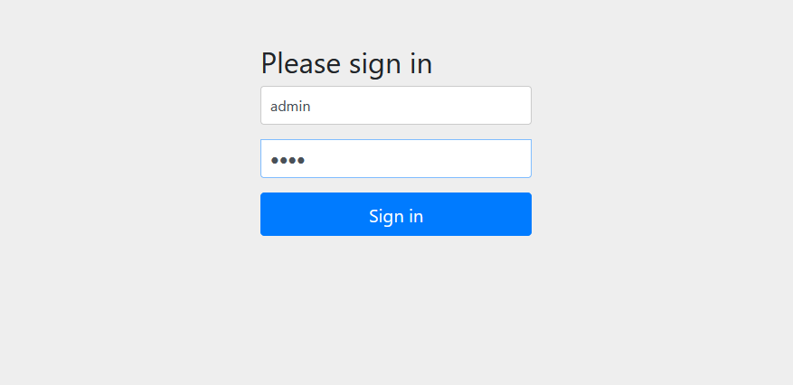
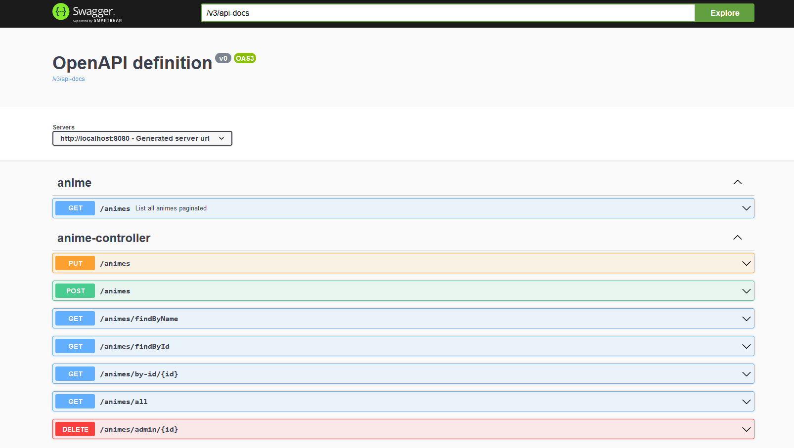

## Spring studies

Finished 🎉

> obs01.: for start application in terminal use the code
> ```bash
> docker-compose up
> ```
> obs02.: On the login page for `admin` access use `Username: admin` | `Password: test`.
> For `user` access use `Username: user` | `Password: test`.

### Steps:

- Introduction ✅
- Creating project ✅
- `@Component`, `@Autowired`, `@SpringBootApplication` ✅
- Hot swap with spring boot devtools ✅
- Starting project with `start.spring.io` ✅
- GET method ✅
- POST method ✅
- DELETE method ✅
- PUT method ✅
- Spring Data JPA ✅
- Framework MapStruct ✅
- Request params ✅
- Custom exceptions ✅
- Global handler ✅
- Transactions ✅
- Validating fields ✅
- Handler for validation fields ✅
- Overwriting handler of spring ✅
- Pagination ✅
- WebMvcConfigurer ✅
- Sorting, SQL log ✅
- RestTemplate ✅
    - getForObject and getForEntity ✅
    - exchange ✅
    - POST ✅
    - PUT and DELETE ✅
- Spring Data JPA Test ✅
    - Introduction ✅
    - Exceptions ✅
- Unit Tests ✅
- Integration Tests ✅
- Maven Profile for Integration Testes ✅
- Spring Security ✅
    - Memory authentication ✅
    - CSRF Token ✅
    - Security level of methods with `PreAuthorize` ✅
    - Main authentication and default login page ✅
    - Authentication with user in database ✅
    - Protection URL with `Antmatcher` ✅
    - Integration tests with Spring Security ✅
- Documentation with SpringDoc OpenAPI ✅
- Spring Boot Actuator ✅
- Prometheus - monitoring application ✅
- Grafana - metrics with graphics ✅


> Login page:
<p>
  
</p>

> Swagger:
<p>
  
</p>
